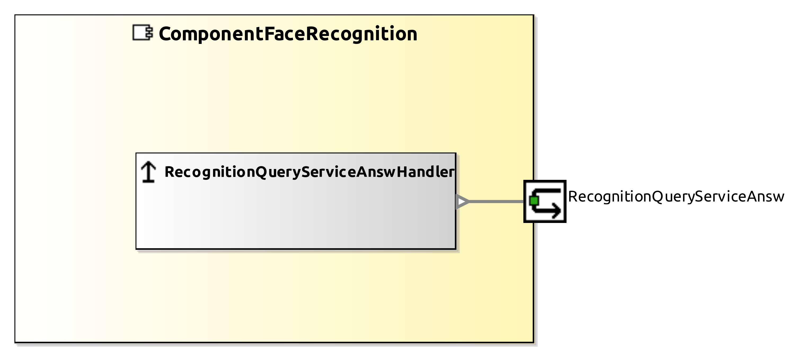

# ComponentFaceRecogtion Component

| Metaelement | Documentation |
|-------------|---------------|
| License |  |
| Hardware Requirements |  |
| Purpose | Rognize face in database |

## Requirements
- opencv 2.0+
- openblas
- tensorflow C++ 

## Service Ports
### QueryService
**RecognitionQueryServiceAnsw**

request: DomainVision::CommVideoImage

answer: CommPerception::CommLabel

## Usage
1. download TensorFlow from https://drive.google.com/open?id=1R-bFuoGqbLHKUv-HoXIEe847mqwvHAnK
2. replace the path of model in smartsoft/src/ComponentFaceRecognitionCore.hh
3. replace the path of your face database (.csv) in smartsoft/src/ComponentFaceRecognitionCore.hh

## Reference

